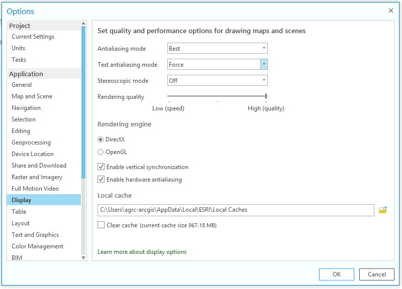
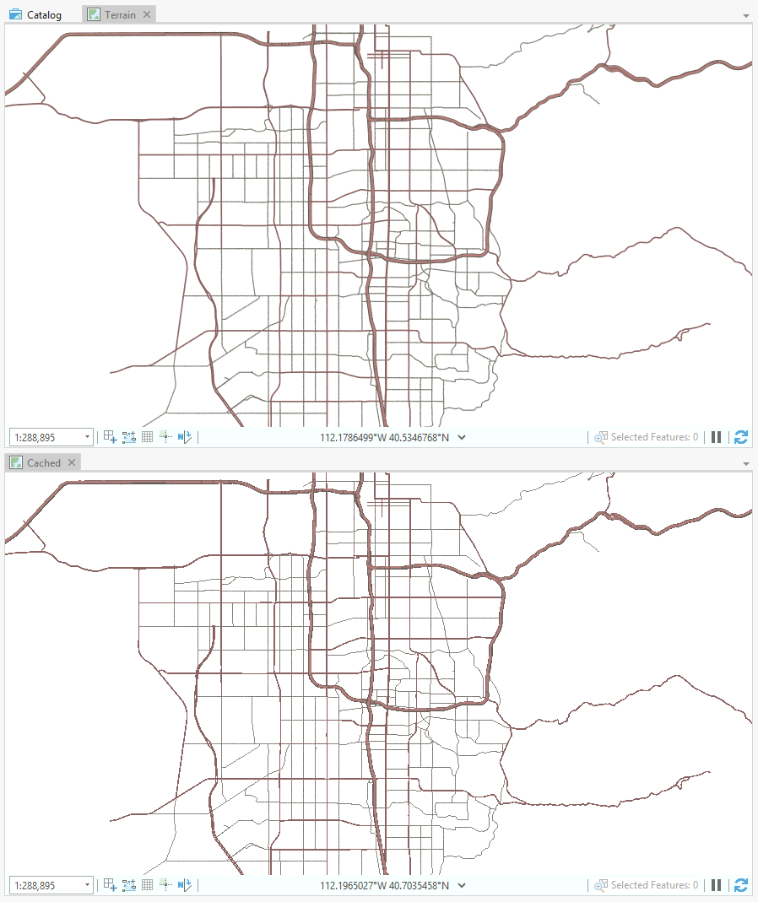

# Generating Traditional Raster Caches with ArcGIS Pro

## Goal

Generate a traditional raster cache in the exploded format (one file per tile) using ArcGIS Pro (not ArcGIS Server).

## Issues

### Anti-aliasing

I'm unable to generate a cache that uses anti-aliasing for feature geometry or text labels. This was originally logged as an enhancement request as a result of one of my support cases (ENH-000136615). The enhancement is marked as implemented at Pro v2.8, however, it doesn't appear to be working to me at v2.9.

Update (Nov 2022): A bug has been created for this in at v3.0.2: [BUG-000153899](https://my.esri.com/#/support/bugs/BUG-000153899).

### Exploded format

I'm also unable to create a cache in the exploded format. This is recorded as [BUG-000136613](https://my.esri.com/#/support/bugs/BUG-000136613). It shows that this is in the product plan. 👍

## Steps to reproduce issues

1. ArcGIS Pro -> Options -> Display
   
1. `propy pro-test.py`
1. Open `Maps.aprx`
1. Compare source map "Terrain" to "Preview" and notice that the anti-alias settings were not honored when the cache was built.
   
1. Open `.\Cache\Exploded\_alllayers\L12` and notice that the cache is still in the compact format despite "EXPLODED" to "storage_format_type"
   

## History

### 6/30/2023

Verified that both bugs still exist at `v3.1.2`. 😞

### 6/18/2024

Verified that both bugs still exist at `v3.3.0`. 😞
Tried both DirectX 11 and 12 with and without hardware acceleration. No change.
